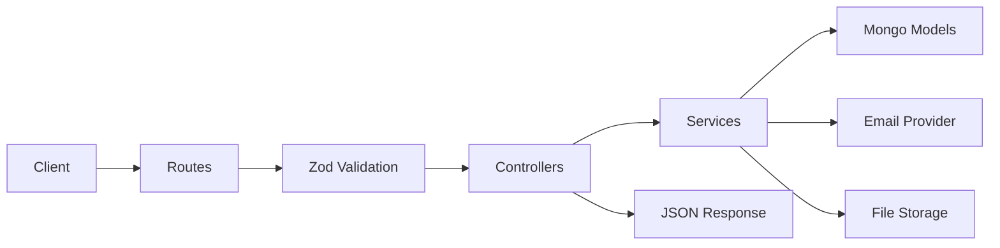

# Pintrest Clone Backend Design

## Goal
Build a secure, modular, tutorial-friendly Pinterest-style backend using:

- Node.js
- TypeScript
- Express
- MongoDB
- Zod
- MVC-inspired module boundaries

The design should be production-minded without unnecessary complexity. The goal is to learn how to structure a real backend correctly.

## Core Product Scope

This backend should support:

- Email/password registration and login
- Email verification
- Password reset
- OAuth login with Google and GitHub
- Session management with refresh token rotation
- Image/file upload for pins and avatars
- Pins and boards as the main content model
- User profiles and saved content

## Design Principles

### 1. Security first
- Validate every request with Zod.
- Hash passwords with a strong algorithm.
- Store refresh tokens hashed, never raw.
- Use HttpOnly cookies for auth tokens.
- Enforce file size and MIME restrictions on uploads.
- Sanitize MongoDB-bound input.
- Avoid leaking internal errors to clients.

### 2. Modular architecture
- Keep routes thin.
- Put business logic in services.
- Put persistence logic in models/repositories.
- Put request validation in reusable middleware.
- Separate auth, uploads, users, pins, boards, and health.

### 3. MVC-inspired structure
Strict MVC is not always ideal for APIs, but the spirit works well:

- Controllers: HTTP request/response handling
- Services: business logic
- Models: MongoDB schemas
- Routes: endpoint wiring
- Middleware: validation, auth, error handling

### 4. Tutorial-friendly
- No hidden magic.
- Clear folder structure.
- Explicit data flow.
- Simple, readable abstractions.
- Small, testable units.

## High-Level Architecture



## Recommended Folder Structure

```text
src/
  app.ts
  server.ts
  config/
    env.ts
    database.ts
    passport.ts
    cors.ts
  constants/
    roles.ts
    auth.ts
  middlewares/
    auth.middleware.ts
    error.middleware.ts
    validate.middleware.ts
    rate-limit.middleware.ts
    upload.middleware.ts
  models/
    user.model.ts
    auth-token.model.ts
    media.model.ts
    pin.model.ts
    board.model.ts
    saved-pin.model.ts
    follow.model.ts
  modules/
    auth/
      auth.routes.ts
      auth.controller.ts
      auth.service.ts
      auth.schemas.ts
    users/
      users.routes.ts
      users.controller.ts
      users.service.ts
      users.schemas.ts
    media/
      media.routes.ts
      media.controller.ts
      media.service.ts
      media.schemas.ts
    pins/
      pins.routes.ts
      pins.controller.ts
      pins.service.ts
      pins.schemas.ts
    boards/
      boards.routes.ts
      boards.controller.ts
      boards.service.ts
      boards.schemas.ts
    health/
      health.routes.ts
  services/
    mail.service.ts
    token.service.ts
    password.service.ts
    storage.service.ts
    oauth.service.ts
  utils/
    cookies.ts
    crypto.ts
    http-error.ts
    logger.ts
    pagination.ts
    response.ts
  types/
    express.d.ts
    globals.d.ts
```

## Request Flow

### Typical authenticated request
1. Client sends cookie or bearer token.
2. Auth middleware validates access token.
3. Controller receives a trusted user context.
4. Service performs business logic.
5. Model reads or writes MongoDB.
6. Response is returned in a stable JSON shape.

### Auth flow
1. User registers or logs in.
2. Password is hashed and verified.
3. Access token and refresh token are issued.
4. Refresh token is stored hashed in MongoDB.
5. Cookies are set with secure flags.
6. Access token expires quickly.
7. Refresh token can rotate and invalidate prior sessions.

### Upload flow
1. Client sends multipart form data.
2. Upload middleware checks file type and size.
3. File is stored safely with a generated name.
4. Metadata is saved in MongoDB.
5. A public URL or signed URL is returned.

## Authentication Design

### Registration
Fields:
- email
- password
- displayName

Rules:
- Email must be unique.
- Password must meet minimum strength requirements.
- Display name must be trimmed and bounded.
- New users start unverified.

### Login
- Accept email and password.
- Verify hash.
- Reject inactive or blocked users.
- Issue access and refresh tokens.
- Store only hashed refresh token records.

### Email verification
- Create a one-time verification token.
- Hash and store the token in MongoDB.
- Email the raw token link to the user.
- Validate and consume once.
- Mark `emailVerifiedAt` when successful.

### Password reset
- Generate one-time reset token.
- Hash and store it.
- Email a reset link.
- Require a new password and token together.
- Invalidate old sessions after password change.

### OAuth
Providers:
- Google
- GitHub

Rules:
- If provider email matches an existing account, link carefully.
- Prefer verified email from provider.
- Do not create duplicate accounts for the same email.
- If a provider does not supply an email, reject the flow.
- Store provider IDs separately in the user model.

### Token strategy
Use two tokens:
- Access token: short-lived, used for requests
- Refresh token: long-lived, rotated and revoked server-side

Recommended behavior:
- Access token lifetime: 15 minutes
- Refresh token lifetime: 30 days
- Refresh token rotation on every refresh
- On reuse of an old refresh token, revoke the chain if possible

### Cookie rules
- `HttpOnly`: yes
- `Secure`: yes in production
- `SameSite`: `lax` for most cases
- Domain: only if needed for subdomain sharing
- Path: `/`

## File Upload Design

### Allowed file types
Start narrow:
- `image/jpeg`
- `image/png`
- `image/webp`
- `image/gif`

Optional later:
- `image/avif`

### Upload rules
- Max size: 5-10 MB depending on user experience
- Reject executable or unknown MIME types
- Generate safe server-side filenames
- Never trust original file names as storage keys
- Store metadata in MongoDB
- Keep actual binary storage abstracted

### Storage options
For tutorial simplicity:
- Local disk first

For production readiness:
- S3-compatible object storage
- Cloudinary for image-focused workflows

Recommended path:
1. Implement storage as an interface.
2. Start with local filesystem storage.
3. Swap to object storage later without changing controllers.

## Data Model Design

### User
Fields:
- `_id`
- `email`
- `displayName`
- `passwordHash`
- `emailVerifiedAt`
- `avatarUrl`
- `role`
- `oauth.googleId`
- `oauth.githubId`
- timestamps

Indexes:
- unique email
- provider ID indexes

### AuthToken
Used for:
- refresh tokens
- email verification tokens
- password reset tokens

Fields:
- `userId`
- `purpose`
- `tokenHash`
- `expiresAt`
- `consumedAt`
- `revokedAt`
- `metadata`

Indexes:
- `userId + purpose`
- `tokenHash`
- TTL on `expiresAt`

### Media
Fields:
- `uploadedBy`
- `originalName`
- `filename`
- `mimeType`
- `size`
- `path`
- `publicUrl`
- timestamps

### Pin
Fields:
- `ownerId`
- `title`
- `description`
- `mediaId`
- `boardId`
- `destinationUrl`
- `tags`
- `visibility`
- `savedCount`
- timestamps

### Board
Fields:
- `ownerId`
- `name`
- `description`
- `coverMediaId`
- `visibility`
- `collaboratorIds`
- timestamps

### SavedPin
Fields:
- `userId`
- `pinId`
- `boardId`
- timestamps

## API Surface

### Auth
- `POST /api/auth/register`
- `POST /api/auth/login`
- `POST /api/auth/logout`
- `POST /api/auth/refresh`
- `POST /api/auth/verify-email`
- `POST /api/auth/resend-verification`
- `POST /api/auth/forgot-password`
- `POST /api/auth/reset-password`
- `GET /api/auth/oauth/google`
- `GET /api/auth/oauth/google/callback`
- `GET /api/auth/oauth/github`
- `GET /api/auth/oauth/github/callback`

### Users
- `GET /api/users/me`
- `PATCH /api/users/me`
- `PATCH /api/users/me/password`
- `PATCH /api/users/me/avatar`
- `GET /api/users/:id`

### Media
- `POST /api/media/upload`
- `GET /api/media/:id`
- `DELETE /api/media/:id`

### Pins
- `POST /api/pins`
- `GET /api/pins`
- `GET /api/pins/:id`
- `PATCH /api/pins/:id`
- `DELETE /api/pins/:id`
- `POST /api/pins/:id/save`
- `DELETE /api/pins/:id/save`

### Boards
- `POST /api/boards`
- `GET /api/boards`
- `GET /api/boards/:id`
- `PATCH /api/boards/:id`
- `DELETE /api/boards/:id`
- `POST /api/boards/:id/pins`
- `DELETE /api/boards/:id/pins/:pinId`

### Health
- `GET /health`
- `GET /ready`

## Security Requirements

### Input validation
- Validate request body, params, query, and multipart metadata.
- Reject unknown fields where appropriate.
- Normalize email addresses.

### Password security
- Hash passwords before storing.
- Use a strong work factor.
- Never log passwords.
- On password change, invalidate sessions.

### Token security
- Hash refresh and one-time tokens.
- Rotate refresh tokens.
- Revoke all sessions on suspicious activity.
- Keep access tokens short-lived.

### HTTP hardening
- `helmet`
- CORS allowlist
- rate limiting on auth endpoints
- request body size limits
- Mongo sanitization
- centralized error responses

### Upload security
- MIME allowlist
- size limit
- no path traversal
- no user-controlled storage path
- optional image reprocessing later to strip metadata

## Middleware Plan

### Validation middleware
- Parses and replaces request body with validated data.
- Fails with a structured error response.

### Auth middleware
- Reads access token from cookie or bearer header.
- Verifies signature and audience.
- Loads user context from DB.
- Attaches trusted user info to `req.authUser`.

### Error middleware
- Converts known errors into stable HTTP responses.
- Hides stack traces from clients in production.

### Rate limiting middleware
- Apply more aggressive limits to auth and password reset routes.
- Apply lighter limits to public read routes.

## Environment Variables

Required:
- `NODE_ENV`
- `PORT`
- `MONGODB_URI`
- `ACCESS_TOKEN_SECRET`
- `REFRESH_TOKEN_SECRET`

Recommended:
- `CLIENT_ORIGIN`
- `COOKIE_NAME_ACCESS`
- `COOKIE_NAME_REFRESH`
- `COOKIE_DOMAIN`
- `JWT_ACCESS_EXPIRES_IN`
- `JWT_REFRESH_EXPIRES_IN`
- `UPLOAD_DIR`
- `MAX_UPLOAD_MB`
- OAuth provider credentials
- SMTP credentials

## Error Handling Strategy

Return a consistent JSON shape such as:

```json
{
  "message": "Request validation failed",
  "details": {}
}
```

Rules:
- Use 4xx for user-caused issues.
- Use 5xx for unexpected server failures.
- Never expose secrets or stack traces in production responses.
- Log full detail server-side only.

## Logging Strategy

Start simple:
- console logging in development
- structured logger later

Preferred behavior later:
- request ID per request
- log level control
- redact secrets
- capture auth events and token rotation events

## Testing Strategy

### Unit tests
- password hashing
- token generation and hashing
- validation schemas
- service logic

### Integration tests
- register/login/refresh flow
- email verification flow
- password reset flow
- upload validation
- protected endpoint access

### Security tests
- invalid token rejection
- refresh token reuse
- forbidden file types
- oversized uploads
- malformed payloads

## Deployment Plan

### Development
- Local MongoDB
- local filesystem uploads
- SMTP sandbox or dev mail provider

### Production
- MongoDB Atlas or managed MongoDB
- object storage for uploads
- HTTPS only
- secure cookies
- environment-based config
- no secrets committed to git

## Build Order

### Phase 1
- Project scaffold
- env config
- database connection
- base middleware
- health route

### Phase 2
- register/login/logout/refresh
- email verification
- password reset
- OAuth login

### Phase 3
- media upload
- user avatar upload
- media metadata storage

### Phase 4
- pins
- boards
- saved pins
- discovery and search

### Phase 5
- tests
- rate limiting tuning
- logging improvements
- production storage integration

## Good Defaults for a Tutorial Project

If you want the project to feel correct without overengineering, these are the best defaults:

- Use access + refresh tokens, not pure sessions.
- Store refresh tokens hashed.
- Validate everything with Zod.
- Use Mongo schemas with strict indexes.
- Keep upload storage abstract.
- Separate public content from authenticated actions.
- Build auth before pins.
- Build pins before feeds.

## Learning Outcome

This project will teach:

- Express architecture
- TypeScript API design
- schema validation
- authentication design
- token rotation
- email workflows
- OAuth integration
- secure file uploads
- modular service boundaries
- MongoDB modeling

## Recommended Next Step

Implement the project in this order:

1. App bootstrap and config
2. User and auth token models
3. Register/login/refresh
4. Email verification and password reset
5. OAuth linking
6. Upload pipeline
7. Pins and boards
8. Tests

